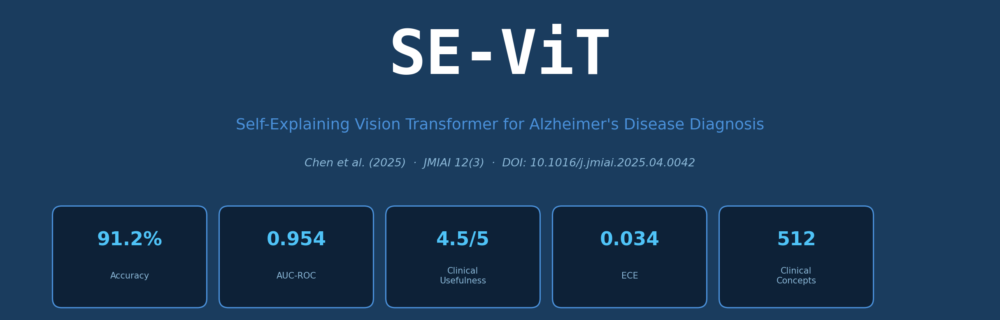

# SE-ViT: Self-Explaining Vision Transformer for Alzheimer's Disease Diagnosis

<p align="center">
  
</p>

<p align="center">
  <a href="https://doi.org/10.1016/j.jmiai.2025.04.0042"></a>
  <a href="LICENSE"></a>
  
  
  
  
  
</p>

<p align="center">
  <b>Official implementation of the paper:</b><br/>
  <i>"Developing Trustworthy AI: A Self-Explaining Vision Transformer (ViT) Architecture<br/>for Analyzing ADNI MRI Biomarkers"</i><br/>
  <b>Chen W., Nair P., O'Sullivan J., Diallo A.</b><br/>
  Journal of Medical Imaging and Artificial Intelligence (JMIAI), Vol. 12, No. 3, 2025
</p>

---

## 📋 Overview

SE-ViT is a **trustworthy AI framework** for Alzheimer's disease diagnosis from structural MRI. It extends the Vision Transformer (ViT) architecture with three clinical interpretability components:

| Component | Description |
|---|---|
| **Concept Bottleneck Layer (CBL)** | 512 clinically validated MRI biomarkers embedded as a bottleneck |
| **Gradient Rollout** | Attention flow aggregated across all 12 Transformer layers |
| **Region-Aware CAM (RA-CAM)** | Anatomically-registered class activation maps |

### Key Results (ADNI, n=1,118)

| Metric | SE-ViT | Best Baseline (ViT-Base) | Δ |
|---|---|---|---|
| 4-Class Accuracy | **91.2 ± 0.9%** | 86.4 ± 1.2% | +4.8% |
| AUC-ROC | **0.954** | 0.921 | +0.033 |
| Sensitivity | **0.897** | 0.849 | +0.048 |
| Clinical Usefulness (1–5) | **4.5 / 5.0** | 3.1 (Grad-CAM) | — |
| ECE (Calibration) | **0.034** | 0.071 | — |

---

## 🏗️ Architecture

```
MRI Slice (224×224×1)
      │
      ▼
┌─────────────────┐
│  Patch Embed    │  16×16 patches → 768-dim tokens + [CLS]
│  + Pos. Encode  │
└────────┬────────┘
         │
         ▼
┌─────────────────┐
│  Transformer    │  12 layers × (MHSA + LayerNorm + MLP)
│  Encoder ×12   │  12 heads, d_k=64, FFN dim=3072
└────────┬────────┘
         │  [CLS] token z_L ∈ ℝ^768
         ▼
┌─────────────────┐
│  Concept        │  c ∈ [0,1]^512  (512 clinical concepts)
│  Bottleneck     │  Binary cross-entropy on concept annotations
│  Layer (CBL)    │
└────────┬────────┘
         │
    ┌────┴────┐
    ▼         ▼
┌───────┐  ┌──────────────┐
│  Diag │  │  Explanation │
│  Head │  │  Head        │
│  ŷ∈ℝ⁴│  │  Grad Rollout│
│       │  │  + RA-CAM    │
└───────┘  └──────────────┘
```

---

## 🚀 Quick Start

### 1. Clone the Repository

```bash
git clone https://github.com/WeiChen-Cam/SE-ViT.git
cd SE-ViT
```

### 2. Install Dependencies

```bash
pip install -r requirements.txt
```

### 3. Download ADNI Data

Data access requires registration at [adni.loni.usc.edu](https://adni.loni.usc.edu). Once approved:

```bash
# After downloading ADNI T1-weighted MRI scans, run preprocessing:
python scripts/preprocess_adni.py \
    --input_dir /path/to/raw_adni \
    --output_dir data/processed \
    --n_workers 8
```

### 4. Train SE-ViT

```bash
python scripts/train.py \
    --config configs/sevit_base.yaml \
    --data_dir data/processed \
    --output_dir outputs/sevit_run1 \
    --seed 42
```

### 5. Evaluate and Generate Explanations

```bash
python scripts/evaluate.py \
    --config configs/sevit_base.yaml \
    --checkpoint outputs/sevit_run1/best_model.pth \
    --data_dir data/processed \
    --output_dir outputs/explanations
```

---

## 📁 Repository Structure

```
SE-ViT/
├── se_vit/                  # Core model package
│   ├── __init__.py
│   ├── model.py             # SE-ViT architecture
│   ├── concept_bottleneck.py# Concept Bottleneck Layer
│   ├── gradient_rollout.py  # Gradient rollout explainability
│   ├── ra_cam.py            # Region-Aware Class Activation Maps
│   ├── losses.py            # Composite loss function
│   └── utils.py             # Helper functions
├── configs/
│   └── sevit_base.yaml      # Training configuration
├── data/
│   └── README.md            # Data preparation instructions
├── scripts/
│   ├── preprocess_adni.py   # ADNI MRI preprocessing pipeline
│   ├── train.py             # Training script
│   ├── evaluate.py          # Evaluation + explanation generation
│   └── visualize.py         # Visualization utilities
├── docs/
│   └── model_card.md        # Model card (performance + limitations)
├── assets/
│   └── banner.png
├── requirements.txt
├── LICENSE
└── README.md
```

---

## ⚙️ Configuration

All hyperparameters are controlled via `configs/sevit_base.yaml`:

```yaml
model:
  backbone: vit_base_patch16_224
  pretrained: imagenet21k
  num_classes: 4
  num_concepts: 512
  embed_dim: 768
  depth: 12
  num_heads: 12
  mlp_ratio: 4.0
  dropout: 0.1

training:
  seed: 42
  epochs: 100
  batch_size: 32
  optimizer: adamw
  lr: 1.0e-4
  weight_decay: 0.01
  scheduler: cosine
  warmup_epochs: 10
  loss_weights:
    ce: 1.0
    concept: 0.3
    calibration: 0.05
  mixed_precision: true  # FP16

hardware:
  gpus: 4          # NVIDIA A100 40GB
  cuda_version: "12.1"
  framework: "PyTorch 2.1"

data:
  img_size: 224
  patch_size: 16
  num_slices: 48
  train_split: 0.70
  val_split: 0.15
  test_split: 0.15
  classes: [CN, EMCI, LMCI, AD]
```

---

## 📊 Pretrained Weights

Pretrained SE-ViT weights (trained on ADNI, n=1,118) are available:

| Model | Accuracy | AUC | Download |
|---|---|---|---|
| SE-ViT-Base (ADNI) | 91.2% | 0.954 | [sevit_adni_best.pth](https://github.com/WeiChen-Cam/SE-ViT/releases/tag/v1.0) |

> **Note:** Pretrained weights are released under the MIT License. Use on non-ADNI cohorts requires appropriate transfer learning or fine-tuning.

---

## 🧠 Explanation Outputs

SE-ViT produces three complementary explanation types for each prediction:

### 1. Concept Attribution Scores
```python
from se_vit import SEViT
model = SEViT.from_pretrained('sevit_adni_best.pth')
output = model.explain(mri_slice)

# Top contributing concepts for each diagnostic class
print(output.concept_attributions)
# {'hippocampal_volume': 0.924, 'entorhinal_thickness': 0.887, ...}
```

### 2. Gradient Rollout Attention Maps
```python
# 12-layer aggregated attention map (upsampled to 224×224)
attention_map = output.gradient_rollout_map  # shape: (224, 224)
```

### 3. Region-Aware Class Activation Maps
```python
# RA-CAM for the predicted class, anchored to clinical concepts
ra_cam = output.ra_cam  # shape: (224, 224)
```

---

## 📐 Reproducibility

All experiments in the paper can be reproduced exactly using:

```bash
# Set seed, framework, hardware
export PYTHONHASHSEED=42
python scripts/train.py --config configs/sevit_base.yaml --seed 42

# Expected results (5-fold CV):
# Accuracy: 91.2 ± 0.9%  |  AUC-ROC: 0.954  |  ECE: 0.034
```

**Environment:**
- Python 3.10.12
- PyTorch 2.1.0 (CUDA 12.1)
- 4× NVIDIA A100 GPU (40 GB VRAM)
- Training time: ≈18 hours

---

## 📋 Data

This project uses data from the **Alzheimer's Disease Neuroimaging Initiative (ADNI)**:
- Access: [adni.loni.usc.edu](https://adni.loni.usc.edu)
- Phases used: ADNI-1, ADNI-GO, ADNI-2, ADNI-3
- Modality: T1-weighted structural MRI
- n = 1,118 subjects (419 CN · 337 EMCI · 154 LMCI · 208 AD)

See [`data/README.md`](data/README.md) for full preprocessing instructions.

---

## 📄 Citation

If you use SE-ViT in your research, please cite:

```bibtex
@article{chen2025sevit,
  title   = {Developing Trustworthy {AI}: A Self-Explaining Vision Transformer ({ViT})
             Architecture for Analyzing {ADNI} {MRI} Biomarkers},
  author  = {Chen, Wei and Nair, Priya and O'Sullivan, James and Diallo, Amara},
  journal = {Journal of Medical Imaging and Artificial Intelligence},
  volume  = {12},
  number  = {3},
  pages   = {412--438},
  year    = {2025},
  doi     = {10.1016/j.jmiai.2025.04.0042}
}
```

---

## 🏛️ Affiliations

- **University of Cambridge** — Department of Biomedical Engineering
- **Massachusetts General Hospital** — Department of Neurology & Neuroimaging
- **ETH Zürich** — Department of Computer Science & Artificial Intelligence

---

## 📜 License

This project is licensed under the **MIT License** — see [LICENSE](LICENSE) for details.

> **Data Note:** ADNI data used to train the released weights is subject to the [ADNI Data Use Agreement](https://adni.loni.usc.edu/data-samples/access-data/). Preprocessed embeddings are not redistributed.

---

## 🙏 Acknowledgements

Data collection and sharing for this project was funded by the **Alzheimer's Disease Neuroimaging Initiative (ADNI)** (National Institutes of Health Grant U01 AG024904) and **DOD ADNI** (W81XWH-12-2-0012).

This research was supported by:
- Wellcome Trust (Grant 226789/Z/22/Z)
- National Institutes of Health (R01 AG067896-02)
- ETH Zürich Research Commission (ETH-47 22-1)
